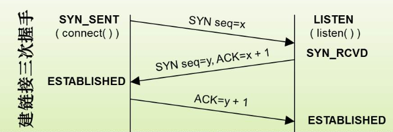
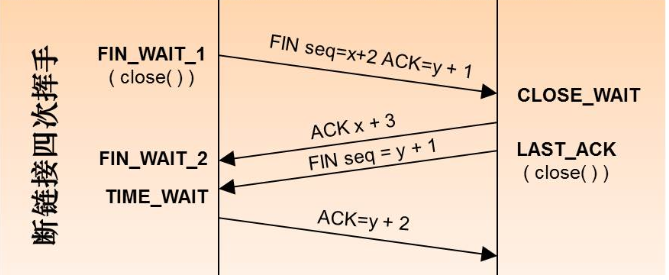
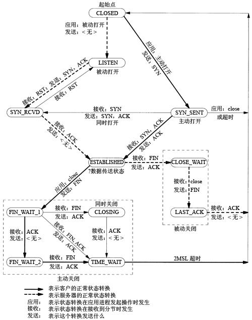

## TCP与UDP的区别


### TCP

-  提供面向连接的、可靠的通信；
- 通过三次握手保证数据发送的安全性，不丢失数据包；
- 连接是点到点的；
- 头部20字节；


### UDP

-  提供面向无连接的、非连接的不可靠、非安全的通信；
- 只保证数据发送，不保证对端是否接收到；
- 支持多对多通信；
- 头部8字节；


<br>


‌

## TCP是如何保证可靠性的‌

1. 校验和：发送时会将报文段进行反码相加，将校验和保存，接收方同样的方式进行计算进行匹配；
2. 序列号：对每个字节的数据都进行了编号；
3. 确认应答机制（ACK）
4. 超时重传机制：在报文发出后一段时间内没收到对方确认消息，就重新发送；
5. 连接管理机制：3次握手、四次挥手；
6. 流量控制；
7. 拥塞控制；

<br>


## 三次握手和四次挥手


### 三次握手过程





第一次握手：建立连接。客户端发送连接请求报文段，将SYN位置为1，Sequence Number为x；然后，客户端进入SYN_SEND状态，等待服务器的确认；

‌

第二次握手：服务器收到客户端的SYN报文段，需要对这个SYN报文段进行确认，设置Ack Number为x+1(SeqNumber+1)；同时自己自己还要发送SYN请求信息，将SYN位置为1，SeqNumber为y；服务器端将上述所有信息放到一个报文段（即SYN+ACK报文段）中，一并发送给客户端，此时服务器进入SYN_RECV状态；

‌

第三次握手：客户端收到服务器的SYN+ACK报文段。然后将AckNumber设置为y+1，向服务器发送ACK报文段，这个报文段发送完毕以后，客户端和服务器端都进入ESTABLISHED状态，完成TCP三次握手。


###  四次挥手过程




第一次分手：主机1（可以使客户端，也可以是服务器端），设置SeqNumber和AckNumber，向主机2发送一个FIN报文段；此时，主机1进入FIN_WAIT_1状态；这表示主机1没有数据要发送给主机2了；


第二次分手：主机2收到了主机1发送的FIN报文段，向主机1回一个ACK报文段，AckNumber为SeqNumber加1；主机1进入FIN_WAIT_2状态；主机2告诉主机1，我“同意”你的关闭请求；


第三次分手：主机2向主机1发送FIN报文段，请求关闭连接，同时主机2进入LAST_ACK状态；

‌

第四次分手：主机1收到主机2发送的FIN报文段，向主机2发送ACK报文段，然后主机1进入TIME_WAIT状态；主机2收到主机1的ACK报文段以后，就关闭连接；此时主机1等待2MSL后依然没有收到回复则证明Server端已正常关闭，主机1也可以关闭连接了。


> MSL表示报文最大生存时间，MSL一般实际中大约为1~2分钟；

<br>


## TCP的各种状态

### 状态类型

- 客户端独有的：SYN_SENT、FIN_WAIT1、FIN_WAIT2、CLOSING、TIME_WAIT 
- 服务器独有的：LISTEN、SYN_RCVD、CLOSE_WAIT、LAST_ACK 
- 共有的：CLOSED、ESTABLISHED


###  状态转换




‌

<br>

## TIME_WAIT状态过多的原因和处理方法

###  存在原因

 出现TIME_WAIT的原因是因为tcp的可靠性要求，要求主动断开的一方要保持TIME_WAIT至少2MSL的时间。当服务器很忙的时候，就会出现大量TIME_WAIT的情况。


###  造成的影响

如果并发量持续很大，则会占用大量的系统资源，导致新的请求会连接异常。


###  处理方式

 首先可以通过下面的命令查看当前系统的各tcp状态数量：

```bash
netstat -ant|awk '/^tcp/ {++S[$NF]} END {for(a in S) print (a,S[a])}'
```


 编辑内核参数文件，修改下面的参数：

```bash
# /etc/sysctl.conf


# 表示开启SYN Cookies。当出现SYN等待队列溢出时，启用cookies来处理，可防范少量SYN攻击，默认为0，表示关闭；
net.ipv4.tcp_syncookies = 1 


# 表示开启重用。允许将TIME-WAIT sockets重新用于新的TCP连接，默认为0，表示关闭；
net.ipv4.tcp_tw_reuse = 1 


# 表示开启TCP连接中TIME-WAIT sockets的快速回收，默认为0，表示关闭。
net.ipv4.tcp_tw_recycle = 1
```


 然后执行下面的命令生效系统参数：

```bash
sysctl -p
```


 如果还是不够理想，就再添加下面的参数：

```bash
# 表示当keepalive起用的时候，TCP发送keepalive消息的频度。缺省是2小时，改为20分钟。
net.ipv4.tcp_keepalive_time = 1200 


# 表示用于向外连接的端口范围。缺省情况下很小：32768到61000，改为1024到65000。
net.ipv4.ip_local_port_range = 1024 65000 


# 表示SYN队列的长度，默认为1024，加大队列长度为8192，可以容纳更多等待连接的网络连接数。
net.ipv4.tcp_max_syn_backlog = 8192 


# 表示系统同时保持TIME_WAIT套接字的最大数量，如果超过这个数字，TIME_WAIT套接字将立刻被清除并打印警告信息。默认为180000，改为5000。
net.ipv4.tcp_max_tw_buckets = 5000 
```


> 对于Apache、Nginx等服务器，上几行的参数可以很好地减少TIME_WAIT套接字数量，但是对于 Squid，效果却不大。此项参数可以控制TIME_WAIT套接字的最大数量，避免Squid服务器被大量的TIME_WAIT套接字拖死。

